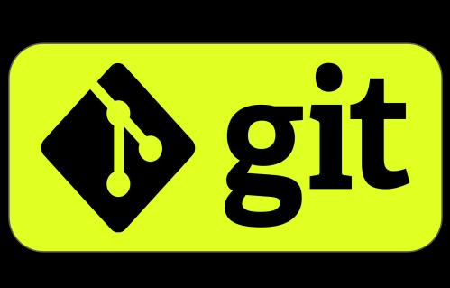

# Git - программа для контроля версий

Программа Git берёт на себя контроль версий
проекта и позволяет переключаться между
ними. Обратите внимание: Git хранит не файлы
целиком, а отличия между ними. Это позволяет
экономить память. Автор программы — Линус
Торвальдс, создатель ОС Linux.

## Список команд

1. git init - инициализация репозитория
2. git add xxxxx.xxx- добавление файла для отслеживания изменений (название англ и расширение)
3. git commit -m "...." - фиксация изменений состаяния файла (сохранение текущего состояния), где в кавычках коментарий по изменению
4. git log - выводит список всех сделанных commit (журнал совершеннх действий по фиксации изменений)
    * git log --graph - Выводим список коммитов в виде красивого графа/дерева
5. git chechout ХХХХХ - gпозволяе пеключаться между различными commit , где ХХХХХХ первые цифры хешкода commit, на который мы хотим переключиться.
    * git checkout master - переключиться на последний сохраненый commit
6. git diff — посмотреть, а чем отличается файл,
отредактированный сейчас, от файла, сохранённого с помощью git commit. (сли мы строки удалили, то увидим
их красного цвета с минусами. А если добавили, они будут зеленого цвета и с плюсами.)
7. git branch - выводит список веток (зеленым указана ветка в которой находимся). Основная "Master".
    * git branch <название новой ветки> - Создать ветку. Делать это надо в папке с репозиторием (Переход в ветку по команде git checkout <название ветки>)
    * git branch -d <название ветки> - Удаляет ветку с указанным именем
8. git merge <название ветки> - Сливает ветку <название ветки>  с текущей веткой

## Работа с удаленными репозиториями в git

9. git clone <Адрес репозитория, который копируем на свой ПК> - Эта команда позволяет склонировать внешний репозиторий на наш ПК
10. git pull - Эта команда позволяет скачать все из текущего репозитория и автоматически
сделать merge с нашей версией
11. git push - эта команда позволяет отправить нашу версию репозитория на внешний
репозиторий. ТРЕБУЕТ АВТОРИЗАЦИИ на внешнем репозитории

